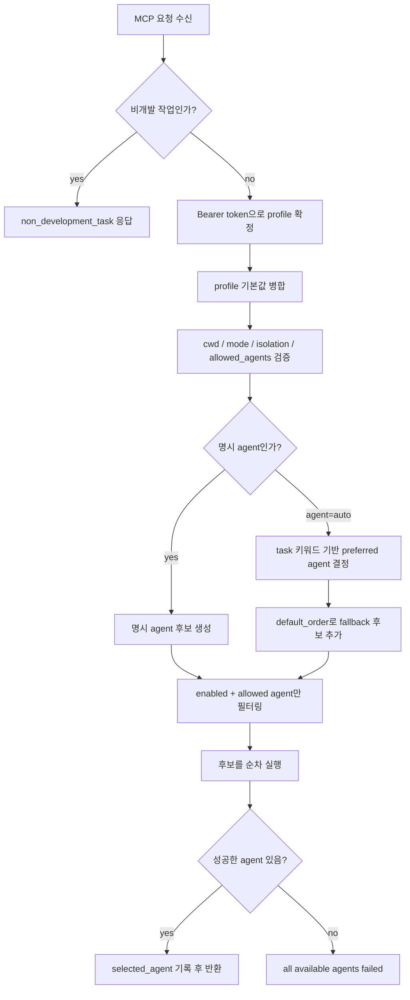

# Agent routing decision flow

## 1. 목적

이 문서는 host-coding-agent MCP가 요청을 받았을 때 OpenCode, Codex,
Antigravity 중 어떤 coding agent를 호출할지 결정하는 과정을 설명한다.

현재 구현은 LLM 기반의 복잡한 planner가 아니라 다음 원칙을 따른다.

> 사용자 대화형 호출에서는 실행 전에 `check_host_coding_agents`를 호출하고
> `check_host_coding_agents`는 compact `execution_health` summary도 함께 반환한다.
> summary가 runtime, cwd mapping, sandbox, worktree blocker를 보여주면
> `check_execution_health`로 상세 진단을 확인한다. 그 다음 `selectable_agents`를 보여준
> 뒤 사용자가 agent를 명시적으로 선택하게 하는 흐름을 권장한다. 실행 tool의 `agent`
> 필드에는 선택된 구체적 이름을 전달한다. 기존 자동화와 하위 호환성을 위해 `auto`
> routing은 계속 지원한다.

1. 비개발 작업은 coding agent로 보내지 않는다.
2. Bearer token으로 인증 profile을 확정한다.
3. 요청에서 agent가 명시되면 그 agent를 우선한다.
4. `agent=auto`이면 task 키워드와 `config.yaml`의 routing 설정으로 후보 순서를
   만든다.
5. profile에서 허용되고 서버에서 enabled 상태인 agent만 실행 후보가 된다.
6. 후보를 순차 실행하고, 성공한 첫 agent를 `selected_agent`로 기록한다.

## 2. Agent discovery와 사용자 선택

`check_host_coding_agents`는 인증 profile 기준으로 다음 핵심 필드를 반환한다.

- `agents`: 설정된 agent의 설치 여부, 활성화 여부, version probe 결과, profile 허용 여부
- `selectable_agents`: 지금 호출 가능한 구체적 agent 이름 목록
- `execution_health`: runtime registration, cwd mapping, sandbox, direct/worktree readiness 요약
- `execution_health_tool`: 실행 가능성 진단에 사용할 `check_execution_health` 안내
- `selection_required`: 대화형 skill이 사용자 선택을 받아야 함을 나타내는 힌트
- `auto_supported`: 기존 자동 routing 지원 여부

각 agent의 `selectable`은 command가 host에 설치되어 있고 서버에서 enabled이며 현재
profile에서 허용될 때만 `true`다. `probe_error`는 version 확인 실패를 설명하지만 command가
존재하면 설치 여부와 별도로 표시된다. `unavailable_reason`은 비활성화, command 없음,
profile 불허를 구분한다.

권장 호출 순서:

```text
check_host_coding_agents
→ check_execution_health(cwd, isolation_mode)
→ selectable_agents를 사용자에게 제시
→ 사용자 선택
→ start_development_task(agent=<선택값>)
→ get_async_job_events(job_id, after)
→ 응답의 requested_agent, selection_mode, candidate_agents, selected_agent 확인
```

`check_execution_health.ok=false`이면 실행하지 않는다. `recommended_next_action`을
사용자에게 전달하고 runtime registration, cwd mapping, sandbox, worktree blocker를 먼저
해결한다. HTTP MCP stream 오류가 의심되면 MCP tool 호출과 별도로 `GET /healthz` 또는
`GET /readyz`를 확인한다.

명시 선택이면 `selection_mode=explicit`이고 candidate는 하나다. `auto`를 사용하는 기존
호출은 `selection_mode=automatic`이며 fallback 후보 전체가 응답에 포함된다.

## 3. 관련 진입점

| 진입점 | 용도 | Agent 결정 방식 |
|---|---|---|
| `run_development_task` | 일반 개발 작업의 권장 단일 API | `agent` 입력값 또는 profile `default_agent` |
| `run_coding_agent` | legacy read-only/proposal 실행 | `agent` 입력값 또는 profile `default_agent` |
| `run_antigravity` | Antigravity 명시 실행 | Antigravity 고정 |
| `run_codex` | Codex 명시 실행 | Codex 고정 |
| `run_opencode` | OpenCode 명시 실행 | OpenCode 고정 |

`run_antigravity`, `run_codex`, `run_opencode`는 사용자가 특정 agent를 강제하고
싶을 때 사용하는 명시 도구다. 단, 해당 agent가 profile의 `allowed_agents`에
포함되어 있어야 한다.

## 3. 전체 결정 흐름



## 4. 비개발 작업 분류

Agent routing 전에 `host_coding_agent/task_classification.py`가 task를 먼저
검사한다.

다음 유형은 coding agent 실행 대상으로 보지 않는다.

| 분류 | 예시 |
|---|---|
| `authentication` | OAuth, 로그인, 토큰 갱신, refresh token |
| `skill_management` | Hermes skill 설치, 삭제, 활성화, 비활성화 |
| `mcp_management` | MCP server 설치, 등록, 연결, 삭제 |
| `runtime_dependency` | Playwright, Chromium, Chrome runtime 설치 |

이 경우 MCP는 agent를 선택하지 않고 다음 형태로 종료한다.

```json
{
  "ok": false,
  "error_code": "non_development_task",
  "category": "authentication",
  "task_owner": "target_mcp_or_profile_runtime",
  "recommended_next_action": "Run the OAuth/login/token refresh flow in the target MCP, Hermes profile runtime, or connected service UI.",
  "do_not_retry_with_host_coding_agent": true,
  "examples": [
    "Use the Google/Fanding MCP auth command or connection flow.",
    "Refresh credentials in the Hermes profile runtime, not through a coding agent."
  ],
  "retryable": false
}
```

이 응답은 최종 실패로 취급한다. 같은 요청을 다른 coding-agent tool로 재시도하지
않아야 한다.

## 5. Profile 결정

profile은 요청의 `assistant_id`가 아니라 Bearer token으로 결정된다.

예를 들어 invest-bot token으로 호출하면 MCP 내부 profile은 항상 `invest-bot`이다.
요청에 `assistant_id=dev-bot`이 들어와도 다른 profile로 실행되지 않는다.

profile은 다음 값을 제한하거나 기본값으로 제공한다.

| 설정 | 역할 |
|---|---|
| `allowed_agents` | 호출 가능한 agent 목록 |
| `default_agent` | 요청에 agent가 없을 때 사용할 기본값 |
| `allowed_modes` | `read_only`, `propose_patch` 등 허용 mode |
| `default_mode` | 요청에 mode가 없을 때 사용할 기본값 |
| `allowed_isolation_modes` | `direct`, `worktree` 허용 여부 |
| `default_isolation_mode` | 일반 개발 작업의 기본 isolation |
| `default_cwd` | 요청에 cwd가 없을 때 사용할 기본 workspace |
| `context` | 언어, 환경 등 profile 기본 실행 context |

## 6. 명시 agent 요청

요청에 `agent`가 명시되면 routing 키워드는 사용하지 않는다.

예:

```json
{
  "task": "README.md를 수정해줘",
  "agent": "opencode"
}
```

이 경우 후보는 `opencode` 하나다.

단, 다음 조건을 모두 만족해야 한다.

1. `opencode`가 `config.yaml`의 `agents.opencode.enabled=true`여야 한다.
2. 현재 profile의 `allowed_agents`에 `opencode`가 있어야 한다.
3. OpenCode command path가 host에서 실행 가능해야 한다.

조건을 만족하지 않으면 해당 agent는 실행되지 않는다.

## 7. Auto routing

요청 agent가 `auto`이면 `host_coding_agent/routing.py`의 `route_agents()`가
후보 순서를 만든다.

현재 로직은 다음과 같다.

```python
if requested != AgentName.auto:
    candidates = [requested]
else:
    lowered = task.casefold()
    if any(keyword in lowered for keyword in opencode_keywords):
        preferred = AgentName.opencode
    elif any(keyword in lowered for keyword in codex_keywords):
        preferred = AgentName.codex
    else:
        preferred = default_order[0]
    candidates = [preferred] + [agent for agent in default_order if agent != preferred]
```

즉, auto routing은 다음 우선순위다.

1. OpenCode 키워드가 있으면 OpenCode 선호
2. Codex 키워드가 있으면 Codex 선호
3. 둘 다 없으면 `routing.default_order[0]` 선호
4. 선호 agent가 실패할 경우 `default_order`의 나머지 agent를 fallback으로 시도

## 8. 현재 기본 routing 설정

현재 `config.yaml`의 기본 순서는 다음과 같다.

```yaml
routing:
  default_order:
    - "antigravity"
    - "codex"
    - "opencode"
```

따라서 키워드가 없는 일반 요청은 기본적으로 다음 순서로 시도된다.

1. Antigravity
2. Codex
3. OpenCode

## 9. Codex 선호 키워드

다음 키워드가 task에 포함되면 Codex가 첫 번째 후보가 된다.

```yaml
codex_keywords:
  - "버그"
  - "단일 파일"
  - "diff"
  - "테스트 실패"
  - "작은 기능"
  - "bug"
  - "single file"
  - "test failure"
```

예:

```text
stock_tracker.py의 버그를 수정해줘
```

후보 순서:

1. Codex
2. Antigravity
3. OpenCode

## 10. OpenCode 선호 키워드

다음 키워드가 task에 포함되면 OpenCode가 첫 번째 후보가 된다.

```yaml
opencode_keywords:
  - "대규모"
  - "리팩토링"
  - "아키텍처"
  - "마이그레이션"
  - "멀티파일"
  - "테스트까지"
  - "전체 수정"
  - "구조 변경"
  - "고도 개발"
  - "refactor"
  - "architecture"
  - "migration"
  - "multi-file"
  - "test suite"
  - "large change"
```

예:

```text
프로젝트 구조 변경과 대규모 리팩토링을 진행해줘
```

후보 순서:

1. OpenCode
2. Antigravity
3. Codex

## 11. Candidate filtering

후보 순서가 만들어진 뒤 실제 실행 전 다시 필터링한다.

필터 조건:

1. `config.agents`에 정의되어 있어야 한다.
2. 해당 agent의 `enabled`가 `true`여야 한다.
3. profile의 `allowed_agents`에 포함되어 있어야 한다.

예를 들어 auto routing 결과가 다음과 같아도:

```text
opencode -> antigravity -> codex
```

profile이 다음처럼 설정되어 있으면:

```yaml
allowed_agents:
  - "opencode"
```

실제 후보는 다음 하나만 남는다.

```text
opencode
```

## 12. 실행과 fallback

`runner.py`는 후보 agent를 순서대로 실행한다.

```text
candidate[0] 실행
  성공하면 selected_agent로 기록하고 종료
  실패하면 candidate[1] 실행
  실패하면 candidate[2] 실행
  ...
모두 실패하면 all available agents failed
```

실패로 취급되는 대표 조건:

- command path 없음
- process return code가 0이 아님
- timeout 발생
- sandbox/security violation

성공한 첫 번째 agent만 최종 `selected_agent`가 된다.

## 13. Direct mode와 Worktree mode의 차이

Agent 선택 자체는 direct와 worktree가 거의 동일하다. 차이는 실행 위치와 적용
방식이다.

| 항목 | Direct | Worktree |
|---|---|---|
| 실행 위치 | 원본 workspace | 관리형 Git worktree |
| Git 필요 여부 | 필요 없음 | 필요 |
| 파일 반영 | 즉시 반영 | proposal/delivery 이후 반영 |
| agent mode | 내부적으로 `apply_patch` | 내부적으로 `apply_patch` |
| rollback 경계 | 약함 | 강함 |

`run_development_task`에서 `isolation_mode=direct`이면 선택된 agent가 원본
workspace를 바로 수정한다.

`isolation_mode=worktree`이면 선택된 agent가 별도 worktree에서 수정하고, 테스트와
proposal/delivery 단계를 거친다.

## 14. 예시

### 예시 1: agent 미지정, 일반 요청

요청:

```text
README.md 마지막에 Telegram E2E test를 추가해줘
```

조건:

```yaml
default_agent: "auto"
default_order: ["antigravity", "codex", "opencode"]
```

결정:

```text
키워드 없음
→ default_order[0] = antigravity
→ 후보: antigravity, codex, opencode
```

### 예시 2: OpenCode 명시

요청:

```text
OpenCode를 사용해서 README.md를 수정해줘
```

MCP tool argument:

```json
{
  "agent": "opencode"
}
```

결정:

```text
명시 agent = opencode
→ 후보: opencode
```

중요한 점은 자연어에 "OpenCode를 사용해서"라고 적는 것만으로 항상 보장되지는
않는다는 것이다. Hermes가 MCP argument의 `agent` 필드에 `opencode`를 넣어야
명시 선택으로 처리된다.

### 예시 3: 대규모 리팩토링 요청

요청:

```text
멀티파일 구조 변경과 테스트까지 진행해줘
```

결정:

```text
OpenCode keyword 감지
→ 후보: opencode, antigravity, codex
```

### 예시 4: 버그 수정 요청

요청:

```text
테스트 실패 원인을 찾아서 버그를 수정해줘
```

결정:

```text
Codex keyword 감지
→ 후보: codex, antigravity, opencode
```

## 15. OpenCode를 기본으로 쓰고 싶은 경우

특정 profile에서 항상 OpenCode를 기본으로 쓰려면 두 가지 방식이 있다.

### 방식 A: profile 기본 agent 변경

```yaml
profiles:
  dev-bot:
    default_agent: "opencode"
```

이 경우 요청에 agent가 없으면 OpenCode만 후보가 된다.

### 방식 B: auto routing 기본 순서 변경

```yaml
routing:
  default_order:
    - "opencode"
    - "codex"
    - "antigravity"
```

이 경우 `agent=auto`이고 특별한 키워드가 없을 때 OpenCode가 먼저 실행된다.
다만 Codex/OpenCode 키워드 규칙은 계속 적용된다.

## 16. 현재 한계

현재 routing은 task 내용을 깊게 이해해서 agent를 선택하지 않는다. 단순한
키워드 기반이다.

따라서 다음 상황에서는 기대와 다를 수 있다.

- 자연어에는 "OpenCode로 해줘"라고 썼지만 MCP argument의 `agent`가 `auto`인 경우
- 키워드가 우연히 포함되어 다른 agent가 선호되는 경우
- profile의 `allowed_agents`가 원하는 agent를 허용하지 않는 경우
- 해당 agent command가 host에 없거나 인증이 만료된 경우

정확한 agent 선택이 중요하면 Hermes가 MCP tool call에 `agent` 값을 명시해야 한다.
