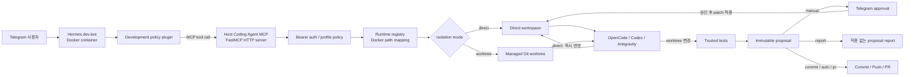
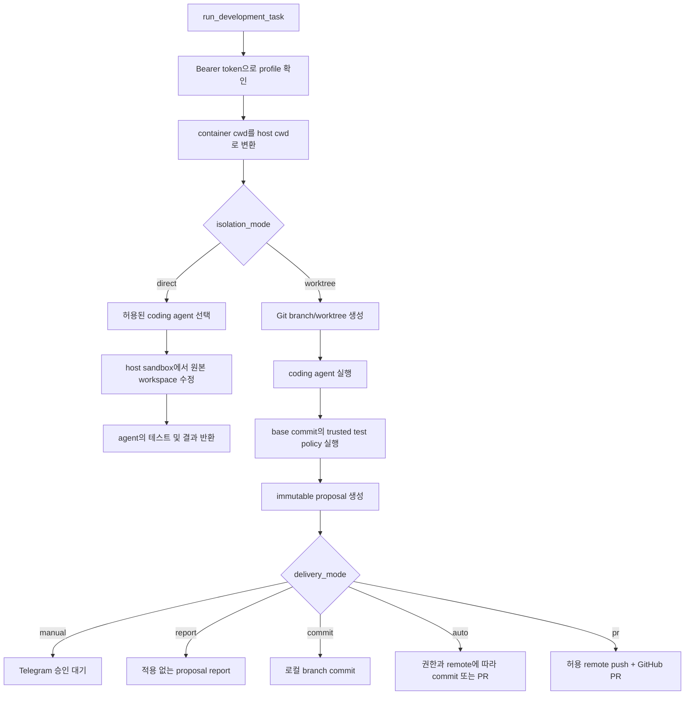
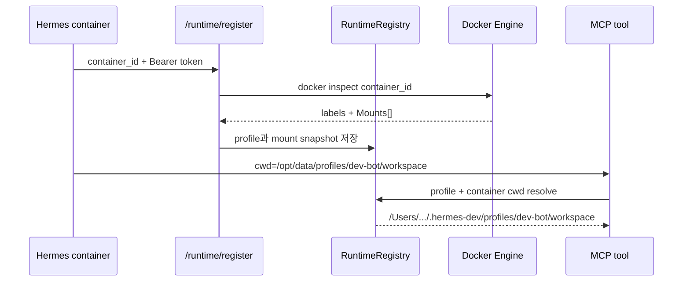
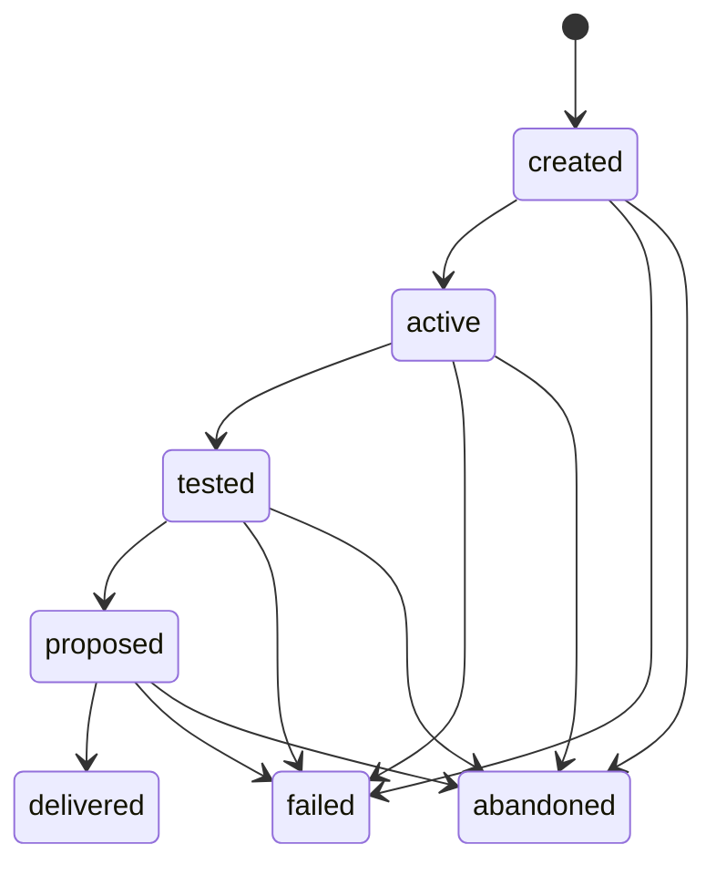
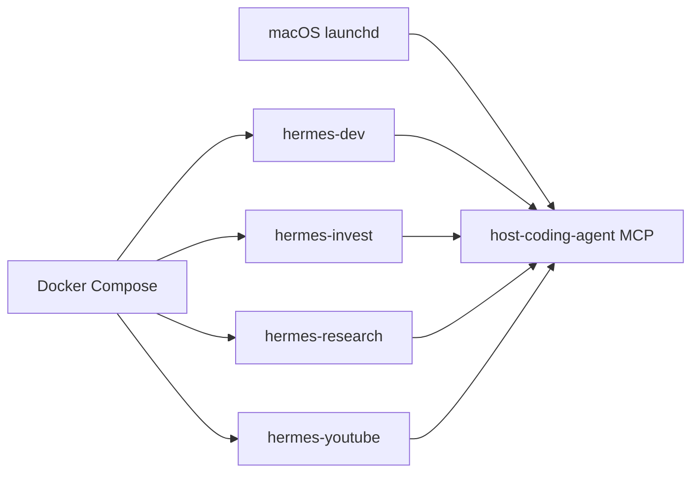

# Host Coding Agent MCP architecture

## 1. 목적

이 시스템은 OpenClaw/Hermes가 직접 코드를 수정하거나 coding-agent CLI를 실행하지
않고, 인증된 host-coding-agent MCP를 통해 OpenCode, Codex, Antigravity 중 하나를
실행하게 한다.

사용자는 Telegram에 자연어로 개발을 요청한다. Hermes는 요청을 MCP tool call로
변환하고, 실제 파일 접근과 coding agent 실행은 macOS host의 MCP 서버가 담당한다.

## 2. 전체 구조

Hermes container는 host 프로젝트를 직접 수정하지 않는다. 요청과 container 경로만
전달하고, MCP가 인증 profile에 맞는 host 경로를 결정한다.

## 3. 기본 요청 흐름

일반 개발 요청의 권장 진입점은 `run_development_task` 하나다.

### Direct

- Git 저장소가 아니어도 된다.
- Coding agent는 profile의 허용 root 안에서 원본 파일을 즉시 수정한다.
- Worktree, proposal, commit, approval을 만들지 않는다.
- 실패 시 일부 파일이 이미 변경됐을 수 있으며 자동 rollback은 없다.
- 현재 Hermes profile의 기본 isolation mode다.

### Worktree

- 대상은 깨끗한 Git 저장소여야 한다.
- 별도 branch와 worktree에서만 coding agent가 쓴다.
- 기준 커밋에 포함된 `.host-coding-agent.yaml`의 테스트만 신뢰한다.
- 테스트 후 변경을 immutable proposal로 고정한다.
- 승인 적용, 로컬 commit, 또는 GitHub PR 방식으로 전달할 수 있다.

## 4. Container-to-host 경로 매핑

Hermes가 전달하는 경로와 MCP가 실제로 사용하는 경로는 서로 다르다.

검증 규칙:

- Bearer token의 profile과 Docker label이 일치해야 한다.
- `Mounts[].Destination` 중 가장 긴 prefix를 선택한다.
- 대응하는 host `Mounts[].Source`가 profile allowed root 안에 있어야 한다.
- host 경로를 직접 전달해도 profile/global allowed root를 모두 검사한다.

## 5. MCP 인터페이스

| 분류 | Tool/route | 역할 |
|---|---|---|
| 단일 개발 | `run_development_task` | direct 또는 worktree 전체 workflow 실행 |
| 단계별 job | `create/run/test/propose/deliver_development_job` | worktree 단계를 개별 제어 |
| 상태 관리 | `get/list/abandon_development_job` | job 조회, 취소와 cleanup |
| Agent 호환 | `run_opencode`, `run_codex`, `run_antigravity` | 명시적 read-only가 아니면 direct로 실행 |
| Legacy proposal | `run_coding_agent` | read-only/propose_patch 호환 경로 |
| Proposal 조회 | `get/list_patch_proposals` | profile 소유 proposal 조회 |
| Runtime | `POST /runtime/register` | Docker container와 host mount 등록 |
| 승인 | `POST /approval/telegram` | Telegram 사용자 검증, 승인·거절·적용 |

## 6. 내부 모듈

| 모듈 | 책임 |
|---|---|
| `server.py` | FastMCP tools, HTTP routes, 전체 orchestration |
| `auth.py`, `profiles.py` | Bearer token, profile 권한과 기본값 |
| `runtime.py` | Docker inspect 기반 container-to-host 경로 매핑 |
| `routing.py`, `runner.py` | Agent 선택, prompt, process와 sandbox 실행 |
| `worktrees.py` | Git worktree job, lock, 상태 전이와 cleanup |
| `testing.py` | 기준 커밋의 trusted test policy 실행 |
| `proposals.py`, `artifacts.py` | worktree diff와 immutable proposal 저장 |
| `approvals.py`, `applier.py` | 승인 상태, patch 검증·적용·rollback |
| `delivery.py` | Manual delivery |
| `automated_delivery.py` | Commit, auto, push, GitHub PR delivery |
| `security.py` | Task 검사, secret redaction |
| `hermes_plugins/development-policy` | Hermes native 개발 도구 차단과 MCP routing |

## 7. 상태와 저장 위치

| 위치 | 내용 |
|---|---|
| `config.yaml` | profile, agent, isolation, security 정책 |
| `artifacts/runtimes.json` | Docker runtime mapping |
| `artifacts/proposals.db` | proposal과 approval audit |
| `artifacts/worktrees.db` | jobs, tests, delivery, cleanup |
| `logs/calls.jsonl` | coding-agent 시작/완료 audit |
| `logs/server.out.log` | HTTP/server lifecycle |
| `logs/server.err.log` | server errors |

SQLite의 proposal, approval event, test result, delivery target/result, cleanup
result는 UPDATE/DELETE trigger로 불변성을 보호한다.

## 8. 신뢰 경계

1. Hermes LLM의 tool 선택은 신뢰하지 않는다. Development policy가 native 개발
   도구를 차단하고 MCP 경로를 주입한다.
2. MCP는 요청의 profile, cwd, agent, mode를 그대로 신뢰하지 않고 Bearer token과
   server-side config로 다시 검증한다.
3. Coding agent는 요청 workspace 또는 managed worktree의 write sandbox 안에서만
   실행한다.
4. Direct는 즉시 쓰기이므로 편리하지만 rollback 경계가 약하다.
5. Worktree manual은 immutable proposal과 Telegram approver 검증 후 원본에 적용한다.
6. PR은 허용된 remote 이름·host와 고정된 fetch/push URL을 다시 검증한다.

## 9. 운영 프로세스

- MCP 서버: launchd의 `com.jaehyunlee.host-coding-agent-mcp`
- Hermes profiles: Docker Compose 서비스
- MCP 기본 endpoint: `http://127.0.0.1:8787/mcp`
- Container에서는 host networking 또는 `host.docker.internal`을 사용한다.
